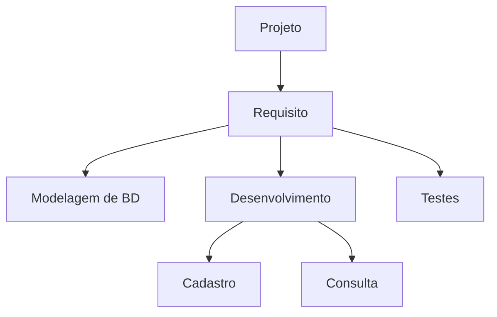
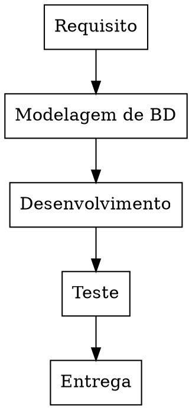

## Gerenciamento de Escopo

Estrutura Analítica de Projeto (EAP)

## Gerenciamento de Cronograma

Diagrama de Gantt

| ID | Atividade | Predecessora | Sucessora | Duração | J | F | M | A | M | J | J | A | S | O | N | D |
| --- | --------- | ------------ | --------- | ------- | - | - | - | - | - | - | - | - | - | - | - | - |
| 05 | Levantamento de Requisito | - | 10 | 30 | -- |  |  |  |  |  |  |  |  |  |  |  | 
| 10 | Modelagem de BD | 05 | 15 | 30 |  | -- |  |  |  |  |  |  |  |  |  |  | 
| 15 | Desenvolvimento | 10 | 20 | 120 |  |  | -- | -- | -- | -- |  |  |  |  |  |  | 
| 20 | Testes | 15 | 25 | 120 |  |  |  |  |  |  | -- | -- | -- | -- |  |  |
| 25 | Entrega | 20 | 30 | 30 |  |  |  |  |  |  |  |  |  |  | -- |  |

## Gerenciamento de Custo

| ID | Atividade | COT | J | F | M | A | M | J | J | A | S | O | N | D |
| --- | --------- | ------------ | - | - | - | - | - | - | - | - | - | - | - | - |
| 05 | Requisito | | 10 | | | | | | | | | | | |
| 10 | Modelagem de BD | | | 5 | 10 | 5 | | | | | | | | |
| 15 | Desenvolvimento | | | | | | 10 | 10 | 10 | 10 | 10 | 10 | 10 | 10 |
| 20 | Teste | | | | | | 10 | 10 | 10 | 10 | 10 | 10 | 10 | 10 |
| 25 | Entrega | | | | | | 10 | 10 | 10 | 10 | 10 | 10 | 10 | 10 |
| | Total Acumulado | 200 | 10 | 15 | 25 | 30 | 40 | 50 | 60 | 70 | 80 | 90 | 100 | 110 |

- [1] COT = Custo Orçado Total
- [2] Unidade = R$ 1000,00

### Grafico Mensal/Acumulado

