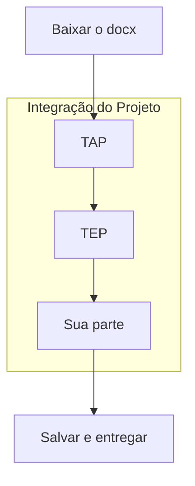

# O que fazer?

## Lista de Afazer

- [ ] Baixar o arquivo **TIC - Integração do Projeto.docx**;
- [ ] Adicionar a **sua parte** abaixo (na sequência) dos outros;
- [ ] Salvar e entregar para o Professor;
- [ ] Ou, postar no Trello para alguém entregar.

## Diagrama Explicativo

